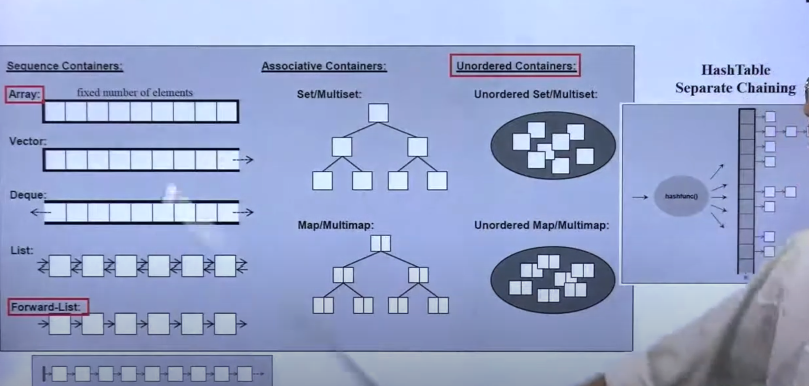

## 第一个 C++ STL Application

+ 容器（Containers）
+ 分配器（Allocator）
+ 算法（Algorithms）
+ 迭代器（Iterators）
+ 适配器（Adapters）
+ 仿函数（Functors）


### 复杂度 Complexity,Big-oh

+ O(1) 或者 O（c） 称为常数时间（constant time）
+ O(n) 称为常数时间（linear time）
+ O(logn) 称为次线性时间(sub-linear time)
+ O(n^2) 称为平方时间（quadratic time）
+ O(n^3) 称为立方时间（cubic time）
+ O(2^n) 称为指数时间（exponential time）
+ O(nlogn)：介于线性以及二次方成长的中间的行为模式

### “前闭后开” 区间

容器里面使用的是前闭后开区间，begin指的是第一个元素，end 指的是最后一个元素的下一个位置；

```c++
for (auto iter = c.begin(); iter != c.end(); ++iter) 
{
    cout << *iter << endl;
}

std::vector<int> vec = {1, 2, 3, 4, 5, 6, 7, 8, 9, 10, 11};

for(auto i : vec) { }

for(auto &i : vec) { }

```

### 容器-结构与分类

+ 序列式容器（Sequence Containers）
    - Array：不可变长数组
    - Vector：可变数组
    - Deque：双向队列
    - List：双向链表
    - Forward-List：单向链表
+ 关联式容器（Associative Containers）：底层使用红黑树实现
    - Set/Multiset
    - Map/Multimap
+ 无序容器（Unordered Containers)
    - Unordered Set/Multiset
    - Unordered Map/Multimap


（Unordered）Multiset 或者（Unordered） Multimap 可以存储多个相同元素




